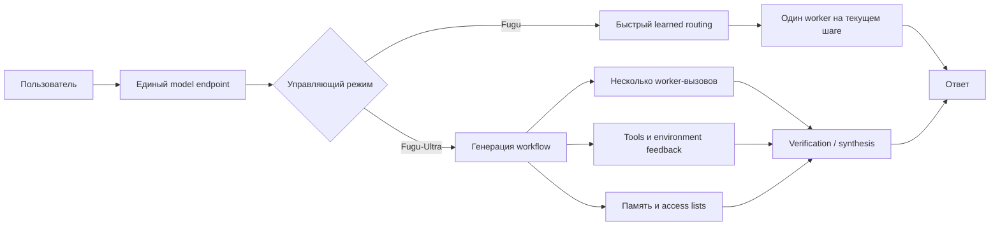
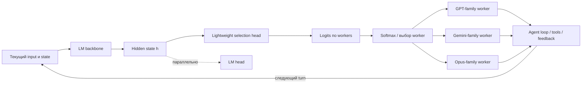
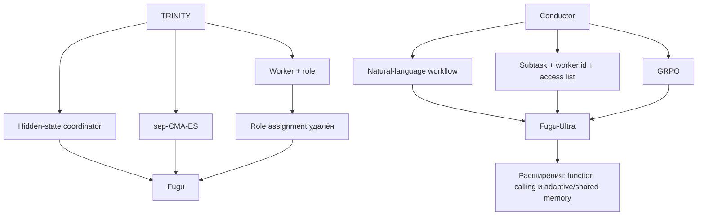

# Sakana Fugu: одна модель или оркестр под единым API?

## Meta description

Sakana Fugu под капотом: routing, Fugu-Ultra, TRINITY, Conductor, benchmark-аудит, стоимость, latency и production-риски.

---

## Основная статья

### Часть I. Контекст и критический разбор

#### 1. Обещание одной модели

**One Model to Command Them All** — почти идеальная продуктовая формула. Она обещает пользователю, что больше не нужно выбирать между GPT, Gemini и Claude, сравнивать их по задачам, поддерживать несколько SDK и вручную собирать цепочки из планировщика, исполнителя и проверяющего. Достаточно вызвать один endpoint, а система сама решит, кто должен работать.

Но в этой формулировке заложен центральный конфликт Fugu.

Как именно *одна модель* может управлять другими моделями? Является ли Sakana Fugu новой foundation model — базовой моделью, обученной на огромном корпусе и самостоятельно генерирующей ответ? Или это router — маршрутизатор, выбирающий подходящий внешний endpoint? Может быть, перед нами meta-model — метамодель, которая не столько решает задачу, сколько определяет, **как** её должны решать другие? А если на один запрос запускается несколько внешних LLM, инструменты, память, проверка и синтез, не скрывается ли за словом *model* полноценная распределённая система?

Технический отчёт даёт ответ, но он не укладывается в одну категорию. Sakana AI называет Fugu семейством обученных оркестраторов (learned orchestrators): пользователь обращается к системе как к одной модели, а внутри она строит агентный каркас (agentic scaffold) над пулом frontier-LLM, выбирая исполнителей, инструкции, связи между промежуточными результатами и момент финального синтеза [Sakana AI, 2026, Sec. 3, pp. 4–5].

Это значит, что Fugu действительно включает языковую модель — управляющую. Но конечная способность системы вынесена не только в неё. Она распределена между оркестратором, внешними worker-моделями, runtime исполнения, инструментами и правилами передачи контекста.

Поэтому первый важный вывод звучит так:

> **Fugu — модель на уровне контракта API, но compound AI system на уровне вычислений.**

Compound AI system — составная AI-система, в которой итоговая способность возникает из композиции моделей, инструментов, памяти, среды исполнения и управляющей логики. Именно так Fugu следует оценивать и как исследовательский объект, и как production-сервис.

#### 2. Главная семантическая ловушка: модель на поверхности, система внутри

Слово «модель» используется в индустрии как минимум в трёх разных смыслах.

Первый — **математический артефакт**: набор параметров и архитектура нейросети. В этом смысле вызов модели обычно означает один inference-проход через конкретный checkpoint или управляемый провайдером его эквивалент.

Второй — **API contract**, то есть контракт интерфейса. Клиент передаёт `model="..."`, сообщения и параметры генерации, а получает ответ. Что происходит за endpoint, пользователь может не знать.

Третий — **продуктовая единица способности**. Если сервис ведёт себя как единый интеллектуальный агент, пользователь склонен воспринимать его как одну модель, даже если внутри работают десятки компонентов.

Fugu сознательно совмещает второй и третий смыслы, но архитектурно не сводится к первому. В отчёте это сформулировано прямо: многоагентная система выставляется наружу через единый модельный интерфейс [Sakana AI, 2026, Sec. 2–3, pp. 3–5]. Внутренне Fugu может маршрутизировать запрос к разным workers, а Fugu-Ultra — строить многошаговые workflow из нескольких агентов [Sakana AI, 2026, pp. 2, 5].



**Что здесь подтверждено:** единый модельный интерфейс, выбор одного worker на входе для Fugu, многоагентные workflow для Fugu-Ultra, access lists, function calling и механизмы памяти описаны в основном отчёте [Sakana AI, 2026, Sec. 3, pp. 4–9].

**Что реконструировано:** разделение на отдельные API-, control- и synthesis-узлы — системная декомпозиция для объяснения. Отчёт не публикует полный serving graph, конкретный final judge или внутренние очереди выполнения.

Единый endpoint поэтому даёт реальное удобство, но не делает backend монолитным. Более того, ключевая ценность Fugu как раз основана на немонолитности: система пытается использовать неодинаковые сильные стороны разных моделей, а не заставить одну сеть быть лучшей во всём.

#### 3. Что Fugu действительно делает

Для первого приближения полезна аналогия с оркестром, но только на один абзац.

**Fugu** похож на быстрого диспетчера, который слушает текущий фрагмент задачи и выбирает наиболее подходящего исполнителя. Он не пишет длинную дирижёрскую партитуру и не назначает формальные роли. Его главное действие — выбрать worker-модель по скрытому состоянию управляющей LM.

**Fugu-Ultra** похож на проектировщика исполнения. Он может разбить запрос на подзадачи, назначить разных workers, определить, какие результаты предыдущих шагов доступны каждому следующему агенту, организовать независимые попытки, проверку и финальную агрегацию.

После этой аналогии лучше перейти к точным терминам.

Fugu — это latency-aware learned router, то есть обученный маршрутизатор, оптимизированный с учётом задержки. В базовом режиме он выбирает **одного worker на конкретный input**. Однако в интерактивной среде input повторяется на каждом шаге: состояние включает накопленный transcript, tool calls и feedback, поэтому Fugu может выбрать другую модель на следующем turn. В Terminal Bench авторы наблюдали именно такое чередование: GPT-5.5 выполнял основную работу, а Opus-4.8 подключался в критические моменты отладки [Sakana AI, 2026, Sec. 4.1.2, p. 11; Sec. 4.4, p. 18].

Fugu-Ultra — learned workflow generator, обученный генератор workflow. Его действие — не одно имя модели, а последовательность шагов вида:

- текст подзадачи;
- `worker id`;
- `access list`, определяющий доступ к результатам предыдущих шагов.

Такое представление допускает цепочки, best-of-N, независимые ветви и деревья с агрегатором [Sakana AI, 2026, Sec. 3.2.1, p. 8], [Nielsen et al., 2026, Sec. 3.1, pp. 3–4].

Это принципиально разные пространства решений. У Fugu пространство координации намеренно сжато до выбора worker. У Fugu-Ultra оно выражено естественным языком и включает декомпозицию, prompt engineering и топологию коммуникации.

<details>

<summary><strong>Синтетический execution trace Fugu</strong></summary>

> **Важно:** это реконструкция, а не реальный production trace из исследования.

##### Fast path: Fugu переключает worker между шагами

Предположим, пользователь просит исправить ошибку слияния двух реализаций алгоритма в репозитории. На первом шаге Fugu видит исходную задачу и выбирает GPT-5.5. После выполнения команд состояние меняется: в transcript появляется конфликт слияния и вывод тестов. Новый state снова поступает в selection head, и на этот раз выигрывает Opus-4.8.

```text
TRACE request_id=req_7f31
model=fugu
task="Объедини две реализации в algo.py и добейся прохождения тестов"

────────────────────────────────────────────────────────────
TURN 0
────────────────────────────────────────────────────────────

state_id=s0
state:
  user_query:
    "Объедини изменения из branch-a и branch-b.
     Итоговая реализация должна пройти test_merge.py."
  transcript: []
  tool_history: []
  environment:
    cwd: /workspace/repo
    git_status: clean

orchestrator:
  backbone_hidden_state: h(s0)
  selection_head:
    workers:
      gpt-5.5:         logit=2.41   probability=0.67
      claude-opus-4.8: logit=1.62   probability=0.30
      gemini-3.1-pro:  logit=-0.91  probability=0.03
  selected_worker: gpt-5.5
  decision_reason:
    "[не раскрывается production-системой]"

dispatch:
  worker: gpt-5.5
  input_context:
    - original_user_query
    - repository_state
    - available_tools
  instruction:
    "Исследуй обе ветви, выполни слияние и запусти тесты."

worker_events:
  - tool_call:
      name: shell
      arguments: "git show branch-a:algo.py"
  - tool_result:
      exit_code: 0
      stdout: "... implementation A ..."

  - tool_call:
      name: shell
      arguments: "git show branch-b:algo.py"
  - tool_result:
      exit_code: 0
      stdout: "... implementation B ..."

  - tool_call:
      name: apply_patch
      arguments:
        file: algo.py
        patch: "<merged implementation>"

  - tool_call:
      name: shell
      arguments: "pytest -q test_merge.py"
  - tool_result:
      exit_code: 1
      stdout:
        "FAILED test_merge.py::test_arc_mapping
         AssertionError: expected [3, 1, 4], got [3, 4, 1]"

worker_output:
  summary:
    "Ветки объединены, но один тест не проходит.
     Возможна ошибка в порядке восстановления mapping."

────────────────────────────────────────────────────────────
TURN 1
────────────────────────────────────────────────────────────

state_id=s1
state:
  user_query:
    "Объедини изменения из branch-a и branch-b..."
  transcript:
    - gpt-5.5:
        "Ветки объединены; тест test_arc_mapping не проходит."
  tool_history:
    - inspected branch-a/algo.py
    - inspected branch-b/algo.py
    - modified algo.py
    - pytest failed with expected=[3,1,4], actual=[3,4,1]
  environment:
    cwd: /workspace/repo
    git_diff: "<current diff>"
    failing_test: test_arc_mapping

orchestrator:
  backbone_hidden_state: h(s1)
  selection_head:
    workers:
      gpt-5.5:         logit=1.11   probability=0.24
      claude-opus-4.8: logit=2.54   probability=0.78
      gemini-3.1-pro:  logit=-0.63  probability=0.04
  selected_worker: claude-opus-4.8

dispatch:
  worker: claude-opus-4.8
  input_context:
    - original_user_query
    - accumulated_transcript
    - current_git_diff
    - failing_test_output
    - previous_tool_results
  instruction:
    "Проверь предположения предыдущего worker.
     Найди первопричину несовпадения mapping и исправь реализацию."

worker_events:
  - tool_call:
      name: shell
      arguments: "sed -n '1,240p' algo.py"
  - tool_result:
      exit_code: 0
      stdout: "<current merged code>"

  - tool_call:
      name: shell
      arguments: "sed -n '1,200p' test_merge.py"
  - tool_result:
      exit_code: 0
      stdout: "<test specification>"

  - analysis_summary:
      "Обе ветви предполагают, что mapping приходит из входных данных,
       но тест требует восстановить его из отношения между дугами.
       Ошибка не в merge order, а в неверной модели задачи."

  - tool_call:
      name: apply_patch
      arguments:
        file: algo.py
        patch: "<reconstruct mapping from graph constraints>"

  - tool_call:
      name: shell
      arguments: "pytest -q"
  - tool_result:
      exit_code: 0
      stdout: "47 passed"

worker_output:
  summary:
    "Исправлена логика восстановления mapping.
     Полный набор тестов проходит."

termination:
  source: external_agent_harness
  condition: tests_passed
  final_status: success

response:
  "Изменения объединены, ошибка восстановления mapping исправлена.
   Все 47 тестов проходят."
```

Главное здесь — не условные logits, а изменение аргумента routing-policy:

$$
s_0 \neq s_1.
$$

На первом шаге (s_0) содержит задачу и исходный репозиторий. На втором $(s_1)$ дополнительно содержит patch, историю действий, конфликтующие предположения и конкретный failure signal. Поэтому выбор

$$
a_0=\text{GPT-5.5}, \qquad
a_1=\text{Opus-4.8}
$$

не противоречит утверждению «один worker на input»: это **два разных input-state внутри одной end-to-end trajectory**. Именно такая per-step адаптация описана авторами для Terminal Bench, где GPT выполнял основную реализацию, а Opus подключался в критических точках отладки. 

##### Deep path: Fugu-Ultra строит workflow до начала исполнения

Для Fugu-Ultra тот же запрос может сначала породить явный план из нескольких worker-вызовов. Здесь routing происходит не как независимый выбор после каждого tool result, а как генерация структуры совместной работы. Отдельные шаги могут выполняться последовательно или параллельно в зависимости от их зависимостей.

```text
TRACE request_id=req_b814
model=fugu-ultra
task="Найди и исправь причину падения теста после слияния двух ветвей"

────────────────────────────────────────────────────────────
ORCHESTRATION PLAN
────────────────────────────────────────────────────────────

available_workers:
  0: gpt-5.5
  1: claude-opus-4.8
  2: gemini-3.1-pro

subtasks = [
  "Независимо исследуй обе ветви, тест и текущую реализацию.
   Сформулируй наиболее вероятную первопричину, но не изменяй файлы.",

  "Независимо проанализируй failing test и текущий diff.
   Ищи ошибки инвариантов, конкурентности, состояния и неверные
   предположения о формате данных. Не используй вывод шага 0.",

  "Сопоставь две диагностики. Проверь спорные места инструментами,
   реализуй минимальное исправление и запусти полный набор тестов.",

  "Проведи независимое ревью patch: проверь скрытые регрессии,
   пограничные случаи и соответствие исходному запросу.
   При необходимости исправь код и верни финальный результат."
]

worker_ids = [0, 1, 0, 1]

access_list = [
  [],
  [],
  [0, 1],
  [0, 1, 2]
]
```

Исполняемый trace может выглядеть так:

```text
────────────────────────────────────────────────────────────
STEP 0 — independent diagnosis A
────────────────────────────────────────────────────────────

worker_id=0
worker=gpt-5.5
access=[]
visible_context:
  - original_user_query
  - repository_snapshot
  - tool_environment
hidden_from_worker:
  - future_steps
  - outputs_of_other_workers

tool_calls:
  - git diff branch-a..branch-b
  - inspect algo.py
  - inspect test_merge.py

result_id=r0
result:
  hypothesis:
    "Ошибка связана с порядком применения преобразований после merge."
  evidence:
    - "actual sequence differs only by two positions"
    - "branch-b changes traversal order"
  proposed_check:
    "Сравнить порядок обхода с ожидаемым mapping."

────────────────────────────────────────────────────────────
STEP 1 — independent diagnosis B
────────────────────────────────────────────────────────────

worker_id=1
worker=claude-opus-4.8
access=[]
visible_context:
  - original_user_query
  - repository_snapshot
  - tool_environment
hidden_from_worker:
  - result r0

tool_calls:
  - inspect test contract
  - trace mapping construction
  - run targeted test with debug output

result_id=r1
result:
  hypothesis:
    "Порядок обхода — симптом. Корневая ошибка в том,
     что mapping копируется из ветви, хотя должен быть
     восстановлен из ограничений графа."
  evidence:
    - "ни одна ветвь не содержит ожидаемого mapping"
    - "тест задаёт отношение, из которого mapping выводится"
  proposed_fix:
    "Построить mapping из arc constraints."

────────────────────────────────────────────────────────────
STEP 2 — implementation and verification
────────────────────────────────────────────────────────────

worker_id=0
worker=gpt-5.5
access=[0, 1]
visible_context:
  - original_user_query
  - repository_snapshot
  - result r0
  - result r1
  - own tool trajectory for this step

instruction_context:
  previous_results:
    r0: "possible traversal-order bug"
    r1: "mapping must be reconstructed from graph constraints"

tool_calls:
  - reproduce failure
  - add diagnostic assertions
  - implement constraint-based mapping
  - run pytest -q

result_id=r2
result:
  patch: "<diff>"
  tests:
    targeted: "1 passed"
    full_suite: "47 passed"
  conclusion:
    "Диагноз r1 подтверждён; гипотеза r0 описывала симптом."

────────────────────────────────────────────────────────────
STEP 3 — independent review and final synthesis
────────────────────────────────────────────────────────────

worker_id=1
worker=claude-opus-4.8
access=[0, 1, 2]
visible_context:
  - original_user_query
  - result r0
  - result r1
  - result r2
  - current_repository_state

tool_calls:
  - inspect final diff
  - run edge-case tests
  - run static checks
  - verify no branch-specific assumptions remain

result_id=r3
result:
  review:
    correctness: pass
    regression_risk: low
    unresolved_issues: none
  final_answer:
    "Причина падения была не в механическом порядке merge,
     а в неверном предположении об источнике mapping.
     Mapping теперь восстанавливается из ограничений графа;
     полный набор из 47 тестов проходит."

termination:
  condition: last_workflow_step_completed
  final_output_source: r3
```

Здесь `access_list` выполняет сразу две функции.

Во-первых, она задаёт **топологию передачи информации**. Шаги 0 и 1 независимы: второй worker не видит гипотезу первого и потому с меньшей вероятностью повторит его ошибочное предположение. Шаг 2 получает обе диагностики и может сравнить их. Шаг 3 видит весь накопленный материал и выполняет review и synthesis.

Во-вторых, `access_list` ограничивает заражение контекста. В Fugu-Ultra история function calls одного агента не обязана автоматически становиться историей другого. Отчёт описывает внутриворкфлоу-изоляцию: агент видит чужую работу только через разрешённые связи, иначе ранняя ошибочная траектория могла бы направить всех последующих workers по одному и тому же пути — эффект, который авторы называют **orchestration collapse**. При этом runtime должен отдельно хранить принадлежность каждого tool call конкретному worker и его позиции в workflow. 

Важно также не читать этот пример как точное описание production-реализации. Technical Report подтверждает формат `subtask + worker id + access list`, workflow до пяти шагов, поддержку function calling, внутриворкфлоу-изоляцию и shared memory между последовательными workflow. Но он не раскрывает реальный schema trace, внутренние prompts, критерий выбора параллельного исполнения, retry policy, формат persisted memory и точную production termination policy. 


</details>

#### 4. Две системы под одним брендом

Fugu и Fugu-Ultra нельзя понимать как одну и ту же модель с разным `reasoning_effort`. Это два разных operating point — режима работы на границе «качество–задержка», опирающихся на разные исследовательские линии и разные методы обучения [Sakana AI, 2026, pp. 2, 5, 7–9].

| Свойство                          | Fugu                                                      | Fugu-Ultra                                           |
| --------------------------------- | --------------------------------------------------------- | ---------------------------------------------------- |
| Основная задача                   | Быстрый выбор worker                                      | Построение многоагентного workflow                   |
| Действие оркестратора             | Один worker для текущего input/turn                       | Подзадачи, `worker ids`, `access lists`              |
| Координационное пространство      | Узкое                                                     | Динамическое и выразительное                         |
| Декодирование управляющего текста | Не требуется для решения о routing                        | Требуется: workflow генерируется как текст           |
| Обучение                          | SFT по soft targets + sep-CMA-ES                          | GRPO по end-to-end reward                            |
| Типичный критический путь         | Близок к вызову одного worker плюс малый routing overhead | Несколько последовательных и/или параллельных этапов |
| Память между агентами             | В отчёте отдельно не описана как ядро fast path           | Intra-workflow isolation + persistent shared memory  |
| Главный риск                      | Ошибка выбора worker                                      | Ошибка декомпозиции, коммуникации или синтеза        |

Архитектурное уточнение «один worker» критично. Fugu выбирает одного worker **на вход оркестратора**, а не обязательно одного и того же worker на всю многошаговую сессию. В end-to-end обучении состояние на шаге `t` включает transcript, tool calls и execution feedback. Policy может менять выбор на следующем шаге [Sakana AI, 2026, Sec. 3.1.3, p. 7].

Fugu-Ultra, напротив, способен вызвать несколько агентов уже внутри одного построенного workflow. Это даёт больше пространства для кооперации, но одновременно больше мест, где система может ошибиться.

#### 5. Почему benchmark-таблица выглядит убедительно и почему её недостаточно

На первом рисунке Technical Report Fugu и Fugu-Ultra сравниваются с Opus 4.8, Gemini 3.1 Pro, GPT-5.5, а также с непубличными Fable 5 и Mythos Preview. Красные столбцы часто оказываются выше серых: Fugu-Ultra показывает 82,1 на Terminal Bench 2.1, 93,2 на LiveCodeBench, 95,5 на GPQA-Diamond и 86,6 на CharXiv Reasoning 


Это сильный результат. Его не следует обнулять только потому, что система многоагентная. Пользователь в конечном счёте платит за способность решить задачу, а не за архитектурную чистоту сравнения.

Но таблица отвечает на вопрос **«какой endpoint получил больший score?»**, а не на более строгие вопросы:

- сколько model calls потребовалось;
- сколько суммарных input/output токенов было потрачено;
- какой был wall-clock latency;
- сколько ветвей исполнялось параллельно;
- насколько различались retries и timeout policy;
- какова variance результата;
- как меняется качество при одинаковом compute budget.

Appendix A прямо говорит, что baseline-значения часто provider-reported либо взяты из внешних leaderboard-реализаций. SWE Bench Pro, GPQA-Diamond, MRCRv2 и часть других baseline-результатов не пересчитывались авторами в единой инфраструктуре; для LiveCodeBench использовались значения vals.ai, для SciCode и long-context задач — реализации Artificial Analysis, для Terminal Bench — provider results или tbench.ai [Sakana AI, 2026, Appendix A, pp. 26–27].

Это создаёт три методологических ограничения.

**Первое: mixed provenance.** Числа получены разными организациями, иногда в разных harness, с разными retry и decoding policy. Даже при одинаковом названии модели результат может зависеть от версии API и настроек reasoning.

**Второе: system-versus-model comparison.** Fugu-Ultra — система, способная вызвать несколько frontier-моделей. Baseline часто представляет один model endpoint. Сравнение валидно как продуктовый тест, но не изолирует эффект learned orchestration от эффекта большего inference budget.

**Третье: отсутствие общего compute normalization.** В отчёте нет единой таблицы с количеством backend calls, total tokens и стоимостью для каждого benchmark. Поэтому нельзя оценить, какой объём выигрыша связан с более удачной policy, а какой с тем, что система просто делает больше попыток.

Особенно показательно, что Fugu лидирует не везде. На SciCode Fugu набирает 60,1, Fugu-Ultra — 58,7, а внешний Fable 5 — 60,2 в Figure 1. На MRCRv2 GPT-5.5 получает 94,8 против 93,6 у Fugu-Ultra. На Long Context Reasoning Fugu набирает 74,7 и превосходит Ultra с 73,3. Это не слабость отчёта — наоборот, такие результаты помогают увидеть, что более глубокая оркестрация не является монотонно полезной [Sakana AI, 2026, Table 1, p. 11].

Отдельная аккуратность нужна с Humanity’s Last Exam. Figure 1 показывает **text-only** вариант и значение Fugu 48,5, тогда как Table 1 и setup описывают полный набор из 2500 примеров, включая мультимодальные, где Fugu получает 47,2, Fugu-Ultra — 50,0 [Sakana AI, 2026, Fig. 1, p. 1; Table 1, p. 11; Appendix A, p. 26]. Эти числа нельзя смешивать в одной строке как будто это один и тот же эксперимент.

Самая сильная часть доказательной базы — не обзорная bar chart, а controlled experiment AutoResearch. Там scaffold, dataset, evaluation protocol и per-experiment GPU budget фиксированы; различается backend агента. Этот эксперимент не устраняет дополнительный LLM compute внутри Fugu-Ultra, но лучше контролирует окружающую систему и публикует среднее, стандартное отклонение и три seed [Sakana AI, 2026, Sec. 4.3.1, pp. 13–14].

#### 6. Скрытая цена коллективного интеллекта

У единого endpoint есть психологический эффект: он делает сложность невидимой. Но невидимая сложность не исчезает.

В Fugu fast path overhead действительно может быть мал: head работает по hidden state и не ждёт длинной авторегрессивной генерации управляющего текста [Sakana AI, 2026, Sec. 3.1.1, pp. 5–6]. Однако основную стоимость всё равно задаёт выбранный frontier-worker и агентный harness вокруг него.

В Fugu-Ultra появляются дополнительные статьи расхода:

- генерация workflow оркестратором;
- несколько worker-вызовов;
- повторная передача контекста;
- tool calls и environment feedback;
- verification;
- финальный synthesis;
- возможные retries и повторные ветви.

Параллелизм уменьшает wall-clock time только для независимых ветвей. Стоимость при этом почти не уменьшается: два параллельных worker-вызова всё равно оплачиваются как два вызова. А последовательные зависимости — план → реализация → review → исправление → synthesis — образуют критический путь, который нельзя ускорить простым fan-out.

Operational complexity также растёт нелинейно. Система должна учитывать rate limits нескольких providers, несовместимые форматы tool calls, разные context limits, изменение поведения model versions, частичные отказы и неодинаковую семантику safety filters. Даже если пользователь видит один SLA, backend фактически наследует failure surface всех зависимостей.

С наблюдаемостью возникает парадокс. Чем лучше продукт скрывает оркестрацию, тем проще его использовать — и тем труднее объяснить, почему конкретный ответ оказался слабым, дорогим или медленным. Вторичное исследовательское досье, опирающееся на официальные product docs, указывает на отсутствие публичных routing traces, полных call caps и latency-распределений.

#### 7. Предварительный вердикт

До формул и алгоритмов можно сформулировать взвешенный промежуточный вывод.

**Техническая идея содержательна.** Fugu обучает policy композиции поверх уже сильных моделей. Fast path использует внутреннее представление компактной LM и маленький head, а Ultra учится генерировать полноценные workflow.

**Продуктовая упаковка сильна.** Multi-agent backend выставлен как одна модельная поверхность. Для разработчика это снижает порог входа в orchestration.

**Benchmark-преимущества реальны на части задач.** Особенно убедительно выглядят agentic coding, competitive programming, GPQA-Diamond и CharXiv. Но результаты произведены самими авторами, baseline provenance неоднороден, а общий inference compute не нормализован.

**Универсальное превосходство не доказано.** Есть benchmark-наборы, где Fugu сильнее Ultra, и наборы, где лучший одиночный worker выше обоих.

**Orchestration overhead нельзя выносить за скобки.** Дополнительные calls, latency, непрозрачность, безопасность и воспроизводимость — не второстепенные эксплуатационные детали, а часть самой архитектуры.

Главный вопрос поэтому не сводится к выбору между двумя крайностями — «новая форма интеллекта» или «просто больше вызовов». Открытые данные показывают, что в Fugu есть learned coordination, способная выбирать полезные специализации и топологии. Но они пока не позволяют разложить итоговый gain на точные доли:

$$
\Delta Q = \Delta Q_{\text{routing}} + \Delta Q_{\text{workflow}} + \Delta Q_{\text{extra compute}} + \Delta Q_{\text{harness}} + \varepsilon.
$$

Здесь $(\Delta Q)$ — наблюдаемый прирост качества; отдельные слагаемые обозначают вклад выбора worker, структуры workflow, дополнительного test-time compute и внешнего harness. $(\varepsilon)$ собирает взаимодействия и шум. Technical Report подтверждает существование всех этих механизмов, но не публикует экспериментальный дизайн, который идентифицировал бы каждое слагаемое отдельно.

---

### Часть II. Технический разбор

#### Что находится под капотом: формальная постановка

Обученный оркестратор (learned orchestrator) — это policy, которая по текущему состоянию системы выбирает не обязательно следующий токен ответа, а **вычислительное действие над другими моделями**.

Обозначим:

- $q$ — исходный пользовательский запрос;
- $s_t$ — состояние взаимодействия на шаге $t$: запрос, разрешённый transcript, tool calls, наблюдения среды и промежуточные результаты;
- $\mathcal{M}=\{M_1,\dots,M_K\}$ — пул worker-моделей;
- $\pi_\theta$ — policy оркестратора с параметрами $\theta$;
- $a_t$ — действие оркестратора;
- $\tau=(s_0,a_0,s_1,a_1,\dots,s_T)$ — полная trajectory, траектория исполнения;
- $R(\tau)$ — terminal reward, итоговая награда за завершённую траекторию.

Для Fugu действие можно записать как выбор worker:

$$
a_t \in \{1,\dots,K\}, \qquad a_t \sim \pi_\theta(\cdot\mid s_t)
$$

Читается:

> «Действие в момент времени $t$, обозначенное $a_t$, принадлежит множеству от 1 до $K$.»

> «Действие $a_t$ выбирается из распределения политики $\pi_\theta$, обусловленного текущим состоянием $s_t$.»

Для Fugu-Ultra действие сложнее: policy генерирует workflow $w$, состоящий из последовательности шагов:

$$
w = \bigl\{(u_i, m_i, A_i)\bigr\}_{i=1}^{N}
$$

где $u_i$ — текст подзадачи, $m_i$ — id worker-модели, $A_i$ — access list, то есть множество предыдущих шагов, результаты которых разрешено добавить в контекст.

Общая цель обучения формулируется как максимизация ожидаемого конечного успеха:

$$
J(\theta)=\mathbb{E}_{\tau\sim\pi_\theta}[R(\tau)]
$$

читается так:

> «Целевая функция $(J(\theta))$ равна математическому ожиданию награды $(R(\tau))$, усреднённой по траекториям $(\tau)$, которые генерируются политикой $(\pi_\theta)$.»

Смысл формулы простой. Оркестратор оценивается не по красоте собственного плана и не по совпадению с человеческой схемой, а по тому, привела ли вся цепочка — выбор модели, инструменты, ответы, исправления — к успешному исходу. Именно такой end-to-end взгляд связывает TRINITY, Fugu, Conductor и Fugu-Ultra, хотя action space и алгоритмы оптимизации у них различаются [Xu et al., 2026, Sec. 2–3, pp. 3–5; Sakana AI, 2026, Sec. 3.1.3–3.2.3, pp. 7–9].

Ограничение этой формализации состоит в credit assignment — распределении заслуги. Если финальный reward равен единице, неочевидно, какой именно шаг был полезен. Если reward равен нулю, неизвестно, виноват ли router, worker, tool, memory, verifier или synthesizer. Fugu и Fugu-Ultra решают эту проблему по-разному: первый сужает число обучаемых параметров и использует эволюционную оптимизацию, второй генерирует группы workflow и обучается через GRPO.

#### Архитектура Fugu: routing без декодирования управляющего текста

##### Интуиция

Обычный LLM-router часто реализуют как отдельный классификатор: он получает embedding запроса и выдаёт класс модели. Fugu использует более тесную связку. Его backbone — предобученная языковая модель — строит контекстное скрытое представление, а маленькая selection head читает hidden state и выдаёт по одному logit на worker.

Ключевой инженерный ход: оркестратору не нужно декодировать длинное объяснение вида «для этой задачи следует вызвать Opus». Решение принимается непосредственно по внутреннему вектору. LM head и selection head работают параллельно, но для routing используется второй [Sakana AI, 2026, Sec. 3.1.1, Fig. 2, pp. 5–6].



**Подтверждено источником.** Backbone, hidden state, lightweight head, logits по worker-моделям, параллельность с LM head, отказ от role assignment и возможность выбирать worker на каждом состоянии описаны в Figure 2 и Sections 3.1.1–3.1.3 [Sakana AI, 2026, pp. 5–7].

**Реконструкция.** Блок `Agent loop / tools / feedback` показан как единый runtime-узел. В отчёте обучающие trajectories берутся из coding-assistant environments, но точная production-реализация loop не опубликована.

##### Формальная запись


Пусть pre-trained language model backbone строит скрытое состояние

$$
h(s) \in \mathbb{R}^{d}.
$$

Selection head $(f_\theta)$ отображает его в $(K)$ logits:

$$
z=f_\theta(h(s))\in\mathbb{R}^{K}.
$$

Policy выбора worker задаётся softmax:

$$
\pi_\theta(a=j\mid s)=
\frac{\exp(z_j)}{\sum_{k=1}^{K}\exp(z_k)}.
$$

Здесь $(d)$ — размер hidden state, $(K)$ — число доступных workers, $(z_j)$ — оценка пригодности worker $(j)$, а $(\pi_\theta)$ — распределение выбора.

В production система может использовать sampling или argmax. Technical Report формально задаёт вероятностную policy для trajectory learning, но конкретная serving-policy раскрыта не полностью [Sakana AI, 2026, Sec. 3.1.3, p. 7].

<details>

<summary><strong>Если забыли, как работает softmax</strong></summary>

#### Softmax: превращение оценок модели в вероятности

*Интуитивное объяснение того, как нейронная сеть превращает сырые оценки вариантов в распределение вероятностей.*

> 💡 **Softmax превращает набор произвольных оценок модели (логитов) в распределение вероятностей, заставляя варианты конкурировать друг с другом.**
>
> Он отвечает на вопрос: *«Насколько каждый вариант предпочтителен относительно остальных?»*

---

##### Короткий ответ

Модель сначала выдаёт **логиты** — числовые оценки вариантов.

Softmax выполняет три шага:

> **Логиты модели**
> ↓
> **Экспоненциальное усиление различий**
> ↓
> **Нормализация по общей сумме**
> ↓
> **Вероятности, сумма которых равна 1**

Итог:

> **Softmax не выбирает один вариант напрямую, а распределяет вероятность между всеми вариантами пропорционально их относительной уверенности.**

---

##### 1. Логиты: оценки модели до получения вероятностей

*До применения softmax модель выдаёт не вероятности, а необработанные оценки.*

Пусть модель выдала:

$$
z=(2,1,0)
$$

Эти значения ещё не являются вероятностями.

Почему?

* они могут быть отрицательными;
* их сумма не обязана быть равной 1;
* важны не сами значения, а их относительное положение друг относительно друга.

Например:

* логит $2$ означает более сильное предпочтение;
* логит $1$ означает менее сильное предпочтение;
* логит $0$ означает ещё более слабое предпочтение.

> **Интуитивно:** логиты — это внутренние «голоса» модели за каждый вариант.

---

##### 2. Первый этап: усиление различий через экспоненту

*Softmax сначала превращает оценки в положительные веса.*

Для каждого логита вычисляется:

$$
e^{z_i}
$$

Для нашего примера:

$$
(e^2,e^1,e^0)\approx(7.39,2.72,1)
$$

Экспонента делает две вещи:

###### 1. Все значения становятся положительными

Даже отрицательные логиты после экспоненты превращаются в положительные числа.

###### 2. Большие значения получают непропорционально больший вес

Разница между логитами:

$$
2-1=1
$$

кажется небольшой.

Но после экспоненты:

$$
\frac{e^2}{e^1}=e
$$

То есть первый вариант получает вес примерно в:

$$
e\approx2.72
$$

раза больше.

> **Интуитивно:** экспонента усиливает преимущество лидеров.

---

##### 3. Второй этап: нормализация весов

*После усиления необходимо превратить веса в вероятности.*

Функция softmax определяется:

$$
\operatorname{softmax}(z_i)=\frac{e^{z_i}}{\sum_{j=1}^{K}e^{z_j}}
$$

Знаменатель складывает все экспоненциальные веса:

$$
7.39+2.72+1=11.11
$$

После деления получаем:

$$
\operatorname{softmax}(2,1,0)\approx(0.665,0.245,0.090)
$$

Теперь:

* каждое значение находится между 0 и 1;
* сумма всех значений равна 1;
* значения можно интерпретировать как вероятности.

Проверка:

$$
0.665+0.245+0.090=1
$$

> **Интуитивно:** softmax распределяет ограниченный запас вероятности между всеми вариантами.

---

##### Главная интуиция

> **Softmax распределяет единичный объём вероятности между вариантами пропорционально экспонентам их оценок.**

Можно представить, что у модели есть:

> **100% вероятностной массы**

Каждый вариант получает свою долю.

Но варианты конкурируют:

* более высокий логит получает больше;
* более низкий логит получает меньше;
* сумма всех долей всегда остаётся равной 1.

```text
Логиты модели

      ↓

Экспоненциальные веса

      ↓

Нормализация по общей сумме

      ↓

Вероятностное распределение
```

---

##### 4. Почему варианты конкурируют

*Вероятность одного варианта зависит не только от его оценки, но и от оценок остальных вариантов.*

Формула:

$$
p_i=\frac{e^{z_i}}{\sum_j e^{z_j}}
$$

Если один логит увеличивается:

* его вероятность растёт;
* вероятности остальных уменьшаются.

Причина:

> Общая сумма вероятностей всегда должна оставаться равной 1.

Например:

Первое распределение:

$$
(2,1,0)\longrightarrow(0.665,0.245,0.090)
$$

После усиления первого варианта:

$$
(5,1,0)\longrightarrow(0.976,0.018,0.007)
$$

Первый вариант почти забрал всю вероятность.

> **Интуитивно:** softmax превращает соревнование между логитами в соревнование за долю вероятности.

---

##### 5. Почему softmax называется soft max

*Softmax является мягкой версией функции максимума.*

Обычный $\operatorname{argmax}$ выбирает только победителя:

$$
(2,1,0)\longrightarrow(1,0,0)
$$

Он говорит:

> «Победил первый вариант».

Но он теряет информацию о степени уверенности.

Softmax сохраняет эту информацию:

$$
(2,1,0)\longrightarrow(0.665,0.245,0.090)
$$

Теперь видно:

* первый вариант наиболее вероятен;
* второй всё ещё возможен;
* третий маловероятен.

При больших различиях между логитами softmax приближается к обычному максимуму.

> **Интуитивно:** argmax делает жёсткий выбор, softmax показывает распределение уверенности.

---

##### 6. Важное свойство: важны разности логитов

*Softmax учитывает относительные различия между вариантами, а не абсолютный уровень значений.*

Если ко всем логитам прибавить одно и то же число:

$$
\operatorname{softmax}(2,1,0)=\operatorname{softmax}(102,101,100)
$$

результат не изменится.

Почему?

$$
\frac{e^{z_i+c}}{\sum_j e^{z_j+c}}
=
\frac{e^c e^{z_i}}{e^c\sum_j e^{z_j}}
=
\frac{e^{z_i}}{\sum_j e^{z_j}}
$$

Общий множитель сокращается.

То есть softmax спрашивает не:

> «Насколько велик каждый логит сам по себе?»

А:

> «Насколько каждый логит велик относительно остальных?»

---

##### 7. Численно устойчивая форма softmax

*В реальных вычислениях используют форму, которая предотвращает переполнение экспоненты.*

Вместо исходной формулы используют:

$$
p_i=
\frac{e^{z_i-z_{\max}}}
{\sum_j e^{z_j-z_{\max}}}
$$

Она даёт тот же результат, но делает вычисления стабильнее.

Причина:

* большие значения логитов могут привести к слишком большим значениям экспоненты;
* вычитание максимального логита сохраняет относительные различия.

---

##### 8. Температура softmax

*Температура управляет степенью «остроты» распределения.*

Softmax с температурой:

$$
p_i=
\frac{e^{z_i/T}}
{\sum_j e^{z_j/T}}
$$

###### Низкая температура

$$
T<1
$$

Различия усиливаются.

Распределение становится:

* более уверенным;
* более концентрированным.

###### Высокая температура

$$
T>1
$$

Различия сглаживаются.

Распределение становится:

* более равномерным;
* менее уверенным.

Предельные случаи:

$$
T\to0
$$

Softmax приближается к $\operatorname{argmax}$.

$$
T\to\infty
$$

Вероятности становятся почти равными.

---

##### 🧠 Самая глубокая интуиция

> **Логиты выражают относительные предпочтения модели, экспонента превращает разности логитов в отношения весов, а нормализация распределяет единицу вероятности между этими весами.**

Особенно важное свойство:

$$
\frac{p_i}{p_j}=e^{z_i-z_j}
$$

То есть разность логитов напрямую определяет отношение вероятностей.

Если:

$$
z_i-z_j=1
$$

то:

$$
\frac{p_i}{p_j}=e\approx2.72
$$

Следовательно, вариант $i$ получает вероятность примерно в 2.72 раза выше, чем вариант $j$.

---

##### Итоговая концептуальная модель

| Уровень      | Интуитивный смысл                      |
| ------------ | -------------------------------------- |
| Логиты       | Сырые предпочтения модели              |
| Экспонента   | Усиление различий между вариантами     |
| Нормализация | Превращение весов в вероятности        |
| Softmax      | Конкурентное распределение уверенности |
| Температура  | Управление резкостью выбора            |

---

##### ✅ Главное

* Softmax превращает логиты в вероятности.
* Экспонента усиливает различия между оценками.
* Нормализация заставляет вероятности суммироваться в 1.
* Варианты конкурируют за общий запас вероятности.
* Softmax сохраняет информацию об уверенности модели.
* Важны не абсолютные значения логитов, а их относительные различия.

> **Softmax — это механизм превращения внутренних предпочтений модели в вероятностное решение.**

</details>

#### Singular-value fine-tuning

Одной head может не хватить, если исходное пространство hidden states плохо ориентировано под routing. Полностью fine-tune backbone дорого и увеличивает число оптимизируемых параметров. Fugu использует fine-tuning сингулярных значений (singular-value fine-tuning): для выбранных матриц веса выполняется разложение

$$
W=U\Sigma V^\top,
$$

после чего обучаются только масштабы в диагональной матрице $(\Sigma)$, а ортогональные компоненты $(U)$ и $(V)$ остаются фиксированными [Sakana AI, 2026, Sec. 3.1.1, pp. 5–6].

Практический смысл — немного повернуть геометрию представлений в полезную для selection head сторону, не превращая router в полноценный expensive fine-tuning всего backbone. Идея наследует TRINITY, где такой же приём использовался вместе с лёгкой coordination head [Xu et al., 2026, Sec. 3.1, pp. 3–4].

Ограничение: Technical Report не раскрывает размер Fugu-backbone, число адаптируемых матриц и точное количество trainable parameters. Число около 0,6B для coordinator и около 10K для head относится к TRINITY, а не автоматически к production Fugu [Xu et al., 2026, Abstract, pp. 1–2].

<details>

<summary><strong>Если забыли, как работает SVD</strong></summary>

Сингулярное разложение (SVD, Singular Value Decomposition) — это математический метод, который превращает любую сложную прямоугольную таблицу чисел (матрицу) в три более простые и понятные матрицы. Это как разложить сложный музыкальный аккорд на три отдельные ноты, чтобы понять, из чего он состоит.

##### Как устроено SVD

Формула выглядит так: $A = U \Sigma V^T$. Представьте, что исходная матрица $A$ делает какое-то сложное движение или преобразование данных. SVD разбивает это движение на три последовательных шага:

- $V^{T}$ (Поворот): сначала мы поворачиваем наши данные в новое удобное положение.

- $\Sigma$ (Растяжение): затем мы растягиваем или сжимаем пространство по осям (числа на диагонали здесь — это и есть «сингулярные значения», показывающие важность каждого направления).

- $U$ (Финальный поворот): делаем еще один поворот в итоговую систему координат.


##### Геометрический смысл

Если у вас есть круг из точек, матрица $A$ превращает его в эллипс.

SVD находит главные оси этого эллипса.

Длины этих осей — это сингулярные значения ($\Sigma$). Чем больше значение, тем важнее эта ось для формы эллипса.

##### Зачем это нужно на практике

Сжатие картинок: фото — это огромная матрица пикселей. Удалив маловажные сингулярные значения (шум и мелкие детали), мы уменьшаем размер файла в разы, а картинка почти не меняется.

Рекомендательные системы (как у Кинопоиска или Netflix): таблица «пользователи/фильмы» огромна и пуста. SVD помогает найти скрытые «понятия» (например, жанры), которые любят люди, и предсказать фильм вам.

Уменьшение размерности (в машинном обучении): убрать лишние признаки, оставив только суть (близкий родственник метода PCA).

</details>

### Пример: как lightweight head выбирает worker

Предположим, что в учебном пуле три workers:

- `GPT` — сильный в планировании и математическом кодинге;
- `Gemini` — сильный в научном reasoning;
- `Opus` — сильный в software engineering и debugging.

Пусть head получил logits:

$$
z=(2.1,\;1.4,\;0.2).
$$

Тогда после softmax:

$$
P(\text{GPT})\approx 0.607,
\qquad
P(\text{Gemini})\approx 0.302,
\qquad
P(\text{Opus})\approx 0.091.
$$

При argmax выбран `GPT`. При sampling остаётся примерно 30-процентная вероятность `Gemini`, что может быть полезно при training rollouts, но увеличивает вариативность serving.

Практическая интерпретация: head не обязан понимать бренды так, как их понимает человек. Он учится статистической зависимости между hidden-state паттернами и end-to-end reward. Если API-версия worker меняется, эта зависимость может устареть — отсюда необходимость regression evaluation и, возможно, переобучения policy.

### Первый этап обучения: soft worker targets

#### Почему hard label недостаточно

Самый простой способ обучить router — для каждой задачи выбрать worker с максимальным score и использовать его id как class label. Но такой подход теряет информацию.

Если один worker получил 0,82, второй — 0,81, а третий — 0,30, hard label объявит первый единственно правильным. Router не узнает, что первые два почти эквивалентны. Это особенно плохо при шумных API-моделях: небольшая разница могла возникнуть случайно.

Fugu вместо этого строит мягкую целевую вероятность (soft worker target). Для вопроса $q_i$ каждый worker $M_j$ запускается $n$ раз. Средняя награда равна

$$
\bar r_{i,j}=\frac{1}{n}\sum_{k=1}^{n} r^{M_j}_{k}.
$$

**Где:**

* $i$ — индекс задачи (конкретного пользовательского вопроса $q_i$);
* $j$ — индекс worker-модели $M_j$ из доступного пула моделей;
* $k$ — номер повторного запуска worker-модели для одной и той же задачи;
* $n$ — количество повторов, с которыми оценивается worker $M_j$ на задаче $q_i$;
* $r^{M_j}_{k}$ — reward (награда), полученная worker-моделью $M_j$ в $k$-м запуске;
* $\sum_{k=1}^{n} r^{M_j}_{k}$ — сумма всех наград worker $M_j$ по всем повторным запускам;
* $\frac{1}{n}$ — усреднение по количеству запусков;
* $\bar r_{i,j}$ — средняя награда worker-модели $M_j$ при решении задачи $q_i$.

**Интуитивный смысл:**

$$
\bar r_{i,j}
$$

— это оценка того, насколько хорошо конкретный worker ($M_j$) подходит для конкретной задачи ($q_i$).

Например, если одна задача запускается 5 раз:

$$
r^{M_1}=[1,1,0,1,1]
$$

то:

$$
\bar r_{i,1} = \frac{1+1+0+1+1}{5} = 0.8
$$

Это означает:

> Worker ($M_1$) успешно решает эту задачу примерно в 80% случаев.

Если другой worker имеет:

$$
r^{M_2}=[1,1,1,1,0]
$$

то:

$$
\bar r_{i,2}=0.8
$$

И router получает сигнал:

> обе модели имеют сопоставимую пригодность для этой задачи.

Именно поэтому Fugu использует средний reward, а затем превращает эти значения в **soft worker target** через softmax: вместо жёсткого утверждения «только один worker правильный» модель получает информацию о степени предпочтения между несколькими workers.

Затем scores превращаются в распределение:

$$
p_i(j)=
\frac{\exp(\bar r_{i,j}/\tau)}
{\sum_{j'}\exp(\bar r_{i,j'}/\tau)}.
$$

Где:

- $i$ — индекс задачи;
- $j$ — индекс worker;
- $r^{M_j}_k$ — reward worker $M_j$ в повторе $k$;
- $\bar r_{i,j}$ — средний reward;
- $\tau>0$ — temperature;
- $p_i(j)$ — целевая вероятность выбора worker $j$.

Чем меньше $\tau$, тем распределение ближе к hard winner. Чем больше $\tau$, тем сильнее сглаживаются различия [Sakana AI, 2026, Sec. 3.1.2, p. 6].

#### Численный пример

Пусть три workers получили средние rewards:

$$(0.82,\;0.79,\;0.35),$$

а $\tau=0.1$. Тогда целевое распределение примерно равно

$$p_i\approx(0.571,\;0.423,\;0.005).$$

Hard label оставил бы только первый worker. Soft target сообщает две вещи: второй почти так же хорош, а третий явно слаб. Это более информативный сигнал для routing policy.

#### SFT loss

Оркестратор обучается приближать это распределение. В отчёте используется KL-divergence:

$$
\mathcal{L}_{\text{SFT}}(\theta)=
\frac{1}{|\mathcal D|}
\sum_{i=1}^{|\mathcal D|}
D_{\mathrm{KL}}
\left(
 p_i(\cdot)\;\|\;\pi_\theta(\cdot\mid q_i)
\right).
$$

Здесь $\mathcal D$ — датасет single-step задач; $p_i$ — целевое распределение, полученное из измеренной производительности workers; $\pi_\theta$ — предсказание Fugu.

Минимизация loss заставляет router воспроизводить не только порядок моделей, но и степень уверенности в их различиях. Авторы утверждают, что это даёт стабильную и эффективную инициализацию перед evolutionary stage [Sakana AI, 2026, Sec. 3.1.2, p. 6].

Ограничение очевидно: labels отражают worker pool и evaluation harness на момент сбора. Если модели обновились, изменились цены, tool behavior или ограничения контекста, target distribution может стать неактуальным.

<details>

<summary><strong>Если забыли, как работает KL-divergence</strong></summary>

**KL-divergence (Kullback–Leibler divergence, дивергенция Кульбака–Лейблера)** — это мера того, **насколько одно распределение вероятностей отличается от другого**.

Проще говоря:

> **KL показывает, сколько информации мы теряем, если пытаемся описать реальные данные с помощью неправильного распределения.**

---

## 1. Представьте два распределения

Допустим, у нас есть настоящий мир:

**Распределение P** — как реально происходят события:

| Событие | Вероятность |
| ------- | ----------- |
| Солнце  | 70%         |
| Дождь   | 30%         |

Но наша модель считает:

**Распределение Q**:

| Событие | Вероятность |
| ------- | ----------- |
| Солнце  | 50%         |
| Дождь   | 50%         |

Мы хотим понять:

**Насколько модель Q ошибается относительно реальности P?**

KL отвечает на этот вопрос.

---

## 2. Интуиция через "удивление"

В теории информации есть идея:

> Редкие события несут больше информации.

Например:

* "Сегодня взошло солнце" при вероятности 99% → ничего удивительного.
* "Сегодня выпал снег летом" при вероятности 0.01% → очень удивительно.

Количество информации:

$$
I(x)=-\log P(x)
$$

Чем меньше вероятность → тем больше "сюрприз".

---

Теперь KL говорит:

**Если настоящий мир P, а мы используем модель Q, насколько больше удивления мы получаем?**

Формально:

$$
D_{KL}(P||Q)=
\sum_x P(x)\log\frac{P(x)}{Q(x)}
$$

Разберём:

### $P(x)$

Насколько часто событие реально происходит.

### $Q(x)$

Насколько вероятным его считает модель.

### $\log\frac{P(x)}{Q(x)}$

Насколько модель недооценила или переоценила событие.

---

## 3. Пример с монетой

Настоящая монета:

$$
P=(0.9,0.1)
$$

То есть:

* орёл — 90%
* решка — 10%

Но модель думает:

$$
Q=(0.5,0.5)
$$

Она считает монету честной.

KL считает:

```
Настоящее распределение:
     P

90% ┃█████████
10% ┃█


Модель:
     Q

50% ┃█████
50% ┃█████
```

Модель плохо описывает реальность.

KL будет большим.

---

Теперь модель улучшили:

$$
Q=(0.85,0.15)
$$

Она почти совпадает с реальностью.

```
P:
90% █████████
10% █

Q:
85% ████████▌
15% █▌
```

KL станет маленьким.

---

## 4. Почему KL используется в нейросетях?

Потому что обучение часто сводится к задаче:

> Сделать распределение модели максимально похожим на распределение данных.

Например, классификатор:

Истина:

```
Кошка: 1.0
Собака: 0
Птица: 0
```

Модель:

```
Кошка: 0.7
Собака: 0.2
Птица: 0.1
```

KL говорит:

"Ты должен увеличить вероятность правильного класса и уменьшить остальные".

В итоге оптимизация уменьшает KL.

---

## 5. Связь с Cross-Entropy

Очень важный момент:

$$
D_{KL}(P||Q)=H(P,Q)-H(P)
$$

где:

* $H(P,Q)$ — cross-entropy (ошибка модели)
* $H(P)$ — энтропия настоящего распределения

Так как $H(P)$ постоянно:

$$
\boxed{\text{минимизация KL} \approx \text{минимизация cross-entropy}}
$$

Поэтому обычный loss в классификации:

$$
-\sum y\log(\hat y)
$$

фактически связан с KL-divergence.

---

## 6. Почему KL не симметрична?

Очень важный момент:

$$
D_{KL}(P||Q)\neq D_{KL}(Q||P)
$$

То есть:

"Насколько модель ошибается относительно данных"

не равно

"Насколько данные отличаются от модели".

Пример:

Если модель говорит:

```
Я уверен, что событие невозможно:

Q(x)=0
```

а в реальности:

```
P(x)=0.1
```

то:

$$
\log\frac{0.1}{0}
\rightarrow \infty
$$

KL становится бесконечной.

Модель сделала очень опасное утверждение:

> "Этого никогда не бывает"

---

## 7. Геометрическая интуиция

Можно представить распределения как точки в пространстве:

```
          Q

        *
       /
      /
     /
    *
   P
```

KL — это не обычное расстояние, как евклидово.

Это скорее:

> "Цена ошибки, если заменить одну картину мира другой".

---

## 8. Где KL встречается в ML

### 1. VAE (Variational Autoencoder)

Там есть два распределения:

* настоящее скрытое состояние
* приближённое распределение энкодера

Добавляют:

$$
D_{KL}(q(z|x)||p(z))
$$

чтобы скрытое пространство было похожим на нормальное распределение.

---

### 2. Knowledge Distillation

Большая модель:

```
Teacher:
кот 0.8
собака 0.2
```

Маленькая:

```
Student:
кот 0.6
собака 0.4
```

KL заставляет маленькую модель повторять вероятностное поведение большой.

---

### 3. Reinforcement Learning

В PPO:

$$
D_{KL}(\pi_{old}||\pi_{new})
$$

контролирует, чтобы новая политика не ушла слишком далеко от старой.

---

## Самая короткая интуиция

**KL-divergence — это штраф за то, что модель думает иначе, чем реальность.**

* маленький KL → модель хорошо описывает данные;
* большой KL → модель построила неправильную картину мира.

И ещё короче:

> **KL измеряет, сколько "лишней информации" приходится потратить, когда мы описываем распределение P с помощью модели Q.**

[Видео о KL-divergence на YouTube](https://www.youtube.com/watch?v=tXE23653JrU)

</details>

### Второй этап: sep-CMA-ES на end-to-end trajectories

#### Почему single-step labels недостаточны

Модель, хорошо отвечающая на изолированный coding question, не обязательно хорошо работает внутри реального coding agent. Она может:

- неправильно вызывать инструменты;
- плохо реагировать на compiler output;
- менять лишние файлы;
- застревать в цикле;
- разрушать уже рабочее решение;
- быть сильным planner, но слабым editor;
- выдавать правильную идею в неверном формате.

Поэтому Fugu продолжает обучение на multi-turn trajectories из coding-assistant environments, включая Claude Code, Codex и OpenCode. Состояние $s_t$ включает transcript предыдущих turns, tool calls и execution feedback. На каждом turn Fugu заново выбирает worker, а итоговая trajectory получает terminal reward $R(\tau)\in\{0,1\}$ за успешное завершение задачи [Sakana AI, 2026, Sec. 3.1.3, p. 7].

#### Целевая функция

$$
J(\theta)=\mathbb{E}_{\tau\sim\pi_\theta}[R(\tau)].
$$

В отличие от SFT здесь нет необходимости построить «правильную» последовательность worker ids. Нужно только оценить, завершилась ли вся task trajectory успешно.

#### Упрощённое описание sep-CMA-ES

Separable Covariance Matrix Adaptation Evolution Strategy, или sep-CMA-ES, — эволюционная стратегия с диагональной ковариацией. На итерации $t$ поддерживаются:

- центральный вектор параметров $\theta_t$;
- step size $\sigma_t$;
- диагональная scale matrix $D_t$.

Генерируется population из $\lambda$ кандидатов:

$$
\theta^{(k)}=\theta_t+\sigma_t D_t z^{(k)},
\qquad
z^{(k)}\sim\mathcal N(0,I).
$$

Каждый кандидат исполняется на наборе end-to-end задач. Его fitness — средний terminal reward. Затем лучшие $\mu$ perturbations рекомбинируются:

$$
\theta_{t+1}=
\theta_t+
\sigma_t D_t
\sum_{j=1}^{\mu}w_j z_{j:\lambda}.
$$

Здесь $z_{j:\lambda}$ — perturbation кандидата с $j$-м местом по fitness, а $w_j$ — вес рекомбинации [Sakana AI, 2026, Sec. 3.1.3, Eqs. 4–5, p. 7].

Инженерная интерпретация: вместо вычисления градиента через закрытые worker APIs система слегка изменяет небольшое число параметров router, запускает реальные trajectories, измеряет успех и смещается в сторону более удачных perturbations.

<details>

<summary><strong>Если забыли, как работает sep-CMA-ES</strong></summary>

**Separable Covariance Matrix Adaptation Evolution Strategy (sep-CMA-ES)** — это эволюционный алгоритм оптимизации, который ищет минимум/максимум функции, **обучаясь тому, в каких направлениях лучше двигаться**.

Проще говоря:

> Представьте, что вы ищете самую низкую точку в туманном горном ландшафте. Вы не знаете карту, но можете бросать «шарики-разведчики», смотреть высоту и постепенно менять направление поиска.

CMA-ES делает именно это, только математически.

---

## 1. Базовая идея CMA-ES

Есть функция:

$$
f(x)
$$

Например, нейросеть имеет миллионы параметров:

$$
x = (w_1,w_2,...,w_n)
$$

Нужно найти такие веса, чтобы ошибка была минимальной.

Обычный градиентный спуск:

$$
x_{new}=x-\eta\nabla f(x)
$$

говорит:

> «Посчитай склон и иди вниз».

Но CMA-ES говорит:

> «Я не знаю склон. Я буду пробовать разные варианты и постепенно научусь, куда лучше двигаться».

---

# 2. Как работает обычный CMA-ES

Алгоритм поддерживает **облако кандидатов**:

```
        x
       .
   .       .
       .
  .    ●    .
       .
    .      .
```

● — текущее лучшее предположение.

Каждая итерация:

### Шаг 1. Генерируем решения

Например:

$$
x_i \sim N(m,\sigma^2C)
$$

То есть берём случайные точки из гауссовского распределения.

Где:

* $m$ — центр поиска
* $\sigma$ — масштаб шага
* $C$ — матрица ковариации

---

### Шаг 2. Проверяем качество

Получаем:

```
точка A → ошибка 10
точка B → ошибка 3  ✓
точка C → ошибка 8
точка D → ошибка 20
```

Лучшие точки говорят:

> «Похоже, надо двигаться сюда».

---

### Шаг 3. Меняем распределение

Например было:

```
       *
   *       *
       ●
   *       *
```

После обучения:

```
          *
       *
    ●────────*
       *
```

Облако становится вытянутым в полезном направлении.

---

# 3. Что такое Covariance Matrix Adaptation

Главная идея CMA:

**не все направления одинаково важны.**

Например, у нас два параметра:

$$
x=(x_1,x_2)
$$

Допустим функция имеет долину:

```
        x2

        |
        |
       /
      /
     /
---------------- x1
```

Лучшее движение:

* немного менять $x_1$
* сильно менять $x_2$

CMA-ES это узнаёт.

Матрица ковариации:

$$
C=
\begin{bmatrix}
c_{11}&c_{12}\\
c_{21}&c_{22}
\end{bmatrix}
$$

описывает:

* масштаб каждого направления
* корреляцию между параметрами

То есть алгоритм учится:

> "Если я меняю параметр A, надо одновременно менять параметр B".

---

# 4. Почему нужна Separable версия?

Проблема обычного CMA-ES:

Матрица:

$$
C\in R^{n\times n}
$$

Если параметров миллион:

$$
C=
1000000\times1000000
$$

Это невозможно хранить.

Память:

$$
O(n^2)
$$

Слишком дорого.

---

## Идея sep-CMA-ES

Она говорит:

> "Давайте предположим, что параметры в основном независимы".

То есть:

обычный CMA:

$$
C=
\begin{bmatrix}
1&0.8\\
0.8&1
\end{bmatrix}
$$

учитывает связи.

sep-CMA:

$$
C=
\begin{bmatrix}
1&0\\
0&1
\end{bmatrix}
$$

учитывает только отдельные направления.

---

Вместо полной матрицы:

$$
C
$$

храним только диагональ:

$$
C=
diag(c_1,c_2,...,c_n)
$$

Например:

```
параметр     важность движения

w1            ███████
w2            ██
w3            █████
w4            █
```

---

# 5. Аналогия с настройкой камеры

Представьте фотографа, который ищет лучший кадр.

Обычный CMA-ES:

> "Я понимаю, что увеличение яркости и контраста связаны. Настраиваю их вместе."

sep-CMA-ES:

> "Я отдельно настраиваю яркость, отдельно контраст, отдельно резкость."

Он быстрее, но теряет информацию о взаимодействиях.

---

# 6. Главный алгоритм sep-CMA-ES

Упрощённо:

```
Инициализация:

центр m
шаг σ
диагональ C


while не достигли цели:

    1. Сгенерировать кандидатов

       x_i = m + σ * sqrt(C) * N(0,1)


    2. Оценить функцию

       fitness=f(x_i)


    3. Выбрать лучшие


    4. Обновить центр

       m ← лучшие решения


    5. Обновить σ

       увеличить/уменьшить шаг


    6. Обновить C

       какие параметры требуют больше движения
```

---

# 7. Чем отличается от градиентного обучения?

|                               | Gradient Descent | sep-CMA-ES  |
| ----------------------------- | ---------------- | ----------- |
| Нужны производные             | Да               | Нет         |
| Работает с чёрным ящиком      | Плохо            | Отлично     |
| Использует случайность        | Нет              | Да          |
| Учится структуре пространства | Нет              | Да          |
| Большие модели                | Хорошо           | Ограниченно |

---

# 8. Где применяется?

sep-CMA-ES часто используют:

### Оптимизация гиперпараметров

Например:

```
learning rate
batch size
dropout
архитектура
```

---

### Reinforcement Learning

Когда:

$$
reward = f(policy)
$$

и градиента нет.

---

### Оптимизация физических моделей

Например:

* параметры симулятора
* управление роботами
* инженерный дизайн

---

# 9. Самая короткая интуиция

**CMA-ES:**

> "Я бросаю много вариантов решения, смотрю какие лучше, и поворачиваю облако поиска в успешном направлении."

**sep-CMA-ES:**

> "Я делаю то же самое, но считаю, что каждый параметр можно адаптировать независимо. Это намного дешевле по памяти и быстрее."

---

Если связать с современным ML:

**sep-CMA-ES — это что-то вроде эволюционного аналога Adam без градиентов:**

* Adam хранит адаптивный масштаб каждого параметра через $v_t$;
* sep-CMA-ES хранит адаптивный размер шага через диагональ ковариационной матрицы.

Разница в том, что Adam использует информацию от производных, а sep-CMA-ES — только качество полученных решений.

</details>

#### Почему это практично именно здесь

Эволюционная оптимизация обычно кажется дорогой: нужно оценивать population. Но Fugu ограничивает trainable parameter set лёгкой head и singular-value scales. SFT уже помещает policy в разумную область, а sep-CMA-ES выполняет тонкую end-to-end настройку.

TRINITY даёт более подробное обоснование. Авторы рассматривают coordination objective как высокоразмерный, но слабо связанный между блоками. При бинарных terminal rewards REINFORCE страдает от шумного credit assignment, а диагональная CMA-ES лучше соответствует geometry задачи [Xu et al., 2026, Sec. 3.3, pp. 5, 15–18]. В controlled comparison TRINITY sep-CMA-ES превосходила REINFORCE, random search и SFT на четырёх задачах [Xu et al., 2026, Sec. 4.8, p. 9].

Но переносить этот результат на Fugu без оговорок нельзя. Fugu использует сходный optimisation principle, однако его backbone, training budget, pool и production trajectories не раскрыты полностью.

#### Ограничение terminal reward

Binary reward удобен, но груб. Две неуспешные trajectory могут быть радикально разными: одна почти решила задачу, другая выбрала неподходящего worker с первого шага. Для ES это означает высокую variance fitness estimate и необходимость репликаций. Отчёт говорит об усреднении terminal reward по повторным end-to-end runs, но не публикует полный бюджет Fugu training [Sakana AI, 2026, p. 7].

### От TRINITY к Fugu

TRINITY — не Fugu, но её архитектурная линия видна очень ясно.

TRINITY использует компактную LM примерно на 0,6B параметров и lightweight head примерно на 10K параметров. На каждом turn head выбирает пару **worker + роль**, где роль принадлежит множеству `Thinker`, `Worker`, `Verifier`. Полный transcript снова подаётся coordinator, а процесс завершается, когда Verifier возвращает `ACCEPT`, либо когда исчерпан turn budget [Xu et al., 2026, Abstract, pp. 1–2; Sec. 3.2, pp. 4–5].

Fugu сохраняет hidden-state coordination, lightweight head, singular-value adaptation и sep-CMA-ES, но удаляет role assignment. Выбранная модель всегда вызывается как worker. Авторы прямо связывают это с сужением coordination space и снижением latency [Sakana AI, 2026, Sec. 3.1.1, pp. 5–6].

| Элемент        | TRINITY                                 | Fugu                                                                     | Зачем изменено                                |
| -------------- | --------------------------------------- | ------------------------------------------------------------------------ | --------------------------------------------- |
| Представление  | Hidden state компактной LM              | Hidden state LM backbone                                                 | Сохранить контекстный signal                  |
| Head           | Logits по workers и трём ролям          | Logits только по workers                                                 | Уменьшить action space                        |
| Роли           | Thinker / Worker / Verifier             | Нет role assignment                                                      | Снизить coordination overhead                 |
| Execution      | Многотуровый role-based loop            | Worker selection внутри внешнего agent loop                              | Лучше встроиться в production harness         |
| Termination    | Verifier `ACCEPT` или turn limit        | Зависит от внешнего loop; policy не раскрыта как отдельный verifier rule | Разделить routing и lifecycle agent runtime   |
| Adaptation     | Singular-value fine-tuning              | Singular-value fine-tuning                                               | Малое число trainable parameters              |
| Optimization   | sep-CMA-ES                              | SFT, затем sep-CMA-ES                                                    | Добавить стабильную single-step инициализацию |
| Training tasks | Benchmark-style multi-turn coordination | Single-step mix + real coding trajectories                               | Приблизить policy к реальной эксплуатации     |

Переход можно описать как **latency-oriented specialization** исследовательской идеи. TRINITY доказывала, что маленький coordinator способен управлять несколькими LLM через hidden states и роли. Fugu отказывается от части выразительности, чтобы быстрее принимать routing decision.



**Подтверждено.** Основной отчёт прямо говорит, что Fugu строится на TRINITY, а Fugu-Ultra — на Conductor, и перечисляет production-oriented изменения [Sakana AI, 2026, Sec. 3.1, p. 5; Sec. 3.2, pp. 7–9; Conclusion, p. 19].

**Граница неизвестного.** Размеры production orchestrators, точная доля сохранённых компонентов, serving recursion и внутренняя termination policy не опубликованы. Поэтому стрелки обозначают преемственность идей, а не идентичность checkpoints.