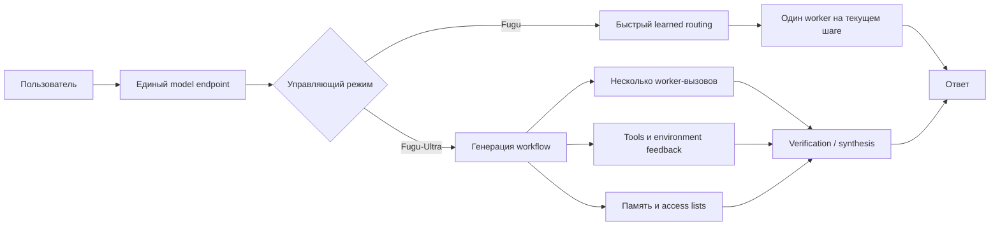

# Sakana Fugu: одна модель или оркестр под единым API?

## Meta description

Sakana Fugu под капотом: routing, Fugu-Ultra, TRINITY, Conductor, benchmark-аудит, стоимость, latency и production-риски.

---

# Основная статья

## Часть I. Контекст и критический разбор

### 1. Обещание одной модели

**One Model to Command Them All** — почти идеальная продуктовая формула. Она обещает пользователю, что больше не нужно выбирать между GPT, Gemini и Claude, сравнивать их по задачам, поддерживать несколько SDK и вручную собирать цепочки из планировщика, исполнителя и проверяющего. Достаточно вызвать один endpoint, а система сама решит, кто должен работать.

Но в этой формулировке заложен центральный конфликт Fugu.

Как именно *одна модель* может управлять другими моделями? Является ли Sakana Fugu новой foundation model — базовой моделью, обученной на огромном корпусе и самостоятельно генерирующей ответ? Или это router — маршрутизатор, выбирающий подходящий внешний endpoint? Может быть, перед нами meta-model — метамодель, которая не столько решает задачу, сколько определяет, **как** её должны решать другие? А если на один запрос запускается несколько внешних LLM, инструменты, память, проверка и синтез, не скрывается ли за словом *model* полноценная распределённая система?

Технический отчёт даёт ответ, но он не укладывается в одну категорию. Sakana AI называет Fugu семейством обученных оркестраторов (learned orchestrators): пользователь обращается к системе как к одной модели, а внутри она строит агентный каркас (agentic scaffold) над пулом frontier-LLM, выбирая исполнителей, инструкции, связи между промежуточными результатами и момент финального синтеза [Sakana AI, 2026, Sec. 3, pp. 4–5].

Это значит, что Fugu действительно включает языковую модель — управляющую. Но конечная способность системы вынесена не только в неё. Она распределена между оркестратором, внешними worker-моделями, runtime исполнения, инструментами и правилами передачи контекста.

Поэтому первый важный вывод звучит так:

> **Fugu — модель на уровне контракта API, но compound AI system на уровне вычислений.**

Compound AI system — составная AI-система, в которой итоговая способность возникает из композиции моделей, инструментов, памяти, среды исполнения и управляющей логики. Именно так Fugu следует оценивать и как исследовательский объект, и как production-сервис.

### 2. Главная семантическая ловушка: модель на поверхности, система внутри

Слово «модель» используется в индустрии как минимум в трёх разных смыслах.

Первый — **математический артефакт**: набор параметров и архитектура нейросети. В этом смысле вызов модели обычно означает один inference-проход через конкретный checkpoint или управляемый провайдером его эквивалент.

Второй — **API contract**, то есть контракт интерфейса. Клиент передаёт `model="..."`, сообщения и параметры генерации, а получает ответ. Что происходит за endpoint, пользователь может не знать.

Третий — **продуктовая единица способности**. Если сервис ведёт себя как единый интеллектуальный агент, пользователь склонен воспринимать его как одну модель, даже если внутри работают десятки компонентов.

Fugu сознательно совмещает второй и третий смыслы, но архитектурно не сводится к первому. В отчёте это сформулировано прямо: многоагентная система выставляется наружу через единый модельный интерфейс [Sakana AI, 2026, Sec. 2–3, pp. 3–5]. Внутренне Fugu может маршрутизировать запрос к разным workers, а Fugu-Ultra — строить многошаговые workflow из нескольких агентов [Sakana AI, 2026, pp. 2, 5].



**Что здесь подтверждено:** единый модельный интерфейс, выбор одного worker на входе для Fugu, многоагентные workflow для Fugu-Ultra, access lists, function calling и механизмы памяти описаны в основном отчёте [Sakana AI, 2026, Sec. 3, pp. 4–9].

**Что реконструировано:** разделение на отдельные API-, control- и synthesis-узлы — системная декомпозиция для объяснения. Отчёт не публикует полный serving graph, конкретный final judge или внутренние очереди выполнения.

Единый endpoint поэтому даёт реальное удобство, но не делает backend монолитным. Более того, ключевая ценность Fugu как раз основана на немонолитности: система пытается использовать неодинаковые сильные стороны разных моделей, а не заставить одну сеть быть лучшей во всём.

### 3. Что Fugu действительно делает

Для первого приближения полезна аналогия с оркестром, но только на один абзац.

**Fugu** похож на быстрого диспетчера, который слушает текущий фрагмент задачи и выбирает наиболее подходящего исполнителя. Он не пишет длинную дирижёрскую партитуру и не назначает формальные роли. Его главное действие — выбрать worker-модель по скрытому состоянию управляющей LM.

**Fugu-Ultra** похож на проектировщика исполнения. Он может разбить запрос на подзадачи, назначить разных workers, определить, какие результаты предыдущих шагов доступны каждому следующему агенту, организовать независимые попытки, проверку и финальную агрегацию.

После этой аналогии лучше перейти к точным терминам.

Fugu — это latency-aware learned router, то есть обученный маршрутизатор, оптимизированный с учётом задержки. В базовом режиме он выбирает **одного worker на конкретный input**. Однако в интерактивной среде input повторяется на каждом шаге: состояние включает накопленный transcript, tool calls и feedback, поэтому Fugu может выбрать другую модель на следующем turn. В Terminal Bench авторы наблюдали именно такое чередование: GPT-5.5 выполнял основную работу, а Opus-4.8 подключался в критические моменты отладки [Sakana AI, 2026, Sec. 4.1.2, p. 11; Sec. 4.4, p. 18].

Fugu-Ultra — learned workflow generator, обученный генератор workflow. Его действие — не одно имя модели, а последовательность шагов вида:

- текст подзадачи;
- `worker id`;
- `access list`, определяющий доступ к результатам предыдущих шагов.

Такое представление допускает цепочки, best-of-N, независимые ветви и деревья с агрегатором [Sakana AI, 2026, Sec. 3.2.1, p. 8], [Nielsen et al., 2026, Sec. 3.1, pp. 3–4].

Это принципиально разные пространства решений. У Fugu пространство координации намеренно сжато до выбора worker. У Fugu-Ultra оно выражено естественным языком и включает декомпозицию, prompt engineering и топологию коммуникации.

<details>

<summary><strong>Синтетический execution trace Fugu</strong></summary>

> **Важно:** это реконструкция, а не реальный production trace из исследования.

#### Fast path: Fugu переключает worker между шагами

Предположим, пользователь просит исправить ошибку слияния двух реализаций алгоритма в репозитории. На первом шаге Fugu видит исходную задачу и выбирает GPT-5.5. После выполнения команд состояние меняется: в transcript появляется конфликт слияния и вывод тестов. Новый state снова поступает в selection head, и на этот раз выигрывает Opus-4.8.

```text
TRACE request_id=req_7f31
model=fugu
task="Объедини две реализации в algo.py и добейся прохождения тестов"

────────────────────────────────────────────────────────────
TURN 0
────────────────────────────────────────────────────────────

state_id=s0
state:
  user_query:
    "Объедини изменения из branch-a и branch-b.
     Итоговая реализация должна пройти test_merge.py."
  transcript: []
  tool_history: []
  environment:
    cwd: /workspace/repo
    git_status: clean

orchestrator:
  backbone_hidden_state: h(s0)
  selection_head:
    workers:
      gpt-5.5:         logit=2.41   probability=0.67
      claude-opus-4.8: logit=1.62   probability=0.30
      gemini-3.1-pro:  logit=-0.91  probability=0.03
  selected_worker: gpt-5.5
  decision_reason:
    "[не раскрывается production-системой]"

dispatch:
  worker: gpt-5.5
  input_context:
    - original_user_query
    - repository_state
    - available_tools
  instruction:
    "Исследуй обе ветви, выполни слияние и запусти тесты."

worker_events:
  - tool_call:
      name: shell
      arguments: "git show branch-a:algo.py"
  - tool_result:
      exit_code: 0
      stdout: "... implementation A ..."

  - tool_call:
      name: shell
      arguments: "git show branch-b:algo.py"
  - tool_result:
      exit_code: 0
      stdout: "... implementation B ..."

  - tool_call:
      name: apply_patch
      arguments:
        file: algo.py
        patch: "<merged implementation>"

  - tool_call:
      name: shell
      arguments: "pytest -q test_merge.py"
  - tool_result:
      exit_code: 1
      stdout:
        "FAILED test_merge.py::test_arc_mapping
         AssertionError: expected [3, 1, 4], got [3, 4, 1]"

worker_output:
  summary:
    "Ветки объединены, но один тест не проходит.
     Возможна ошибка в порядке восстановления mapping."

────────────────────────────────────────────────────────────
TURN 1
────────────────────────────────────────────────────────────

state_id=s1
state:
  user_query:
    "Объедини изменения из branch-a и branch-b..."
  transcript:
    - gpt-5.5:
        "Ветки объединены; тест test_arc_mapping не проходит."
  tool_history:
    - inspected branch-a/algo.py
    - inspected branch-b/algo.py
    - modified algo.py
    - pytest failed with expected=[3,1,4], actual=[3,4,1]
  environment:
    cwd: /workspace/repo
    git_diff: "<current diff>"
    failing_test: test_arc_mapping

orchestrator:
  backbone_hidden_state: h(s1)
  selection_head:
    workers:
      gpt-5.5:         logit=1.11   probability=0.24
      claude-opus-4.8: logit=2.54   probability=0.78
      gemini-3.1-pro:  logit=-0.63  probability=0.04
  selected_worker: claude-opus-4.8

dispatch:
  worker: claude-opus-4.8
  input_context:
    - original_user_query
    - accumulated_transcript
    - current_git_diff
    - failing_test_output
    - previous_tool_results
  instruction:
    "Проверь предположения предыдущего worker.
     Найди первопричину несовпадения mapping и исправь реализацию."

worker_events:
  - tool_call:
      name: shell
      arguments: "sed -n '1,240p' algo.py"
  - tool_result:
      exit_code: 0
      stdout: "<current merged code>"

  - tool_call:
      name: shell
      arguments: "sed -n '1,200p' test_merge.py"
  - tool_result:
      exit_code: 0
      stdout: "<test specification>"

  - analysis_summary:
      "Обе ветви предполагают, что mapping приходит из входных данных,
       но тест требует восстановить его из отношения между дугами.
       Ошибка не в merge order, а в неверной модели задачи."

  - tool_call:
      name: apply_patch
      arguments:
        file: algo.py
        patch: "<reconstruct mapping from graph constraints>"

  - tool_call:
      name: shell
      arguments: "pytest -q"
  - tool_result:
      exit_code: 0
      stdout: "47 passed"

worker_output:
  summary:
    "Исправлена логика восстановления mapping.
     Полный набор тестов проходит."

termination:
  source: external_agent_harness
  condition: tests_passed
  final_status: success

response:
  "Изменения объединены, ошибка восстановления mapping исправлена.
   Все 47 тестов проходят."
```

Главное здесь — не условные logits, а изменение аргумента routing-policy:

$$
s_0 \neq s_1.
$$

На первом шаге (s_0) содержит задачу и исходный репозиторий. На втором $(s_1)$ дополнительно содержит patch, историю действий, конфликтующие предположения и конкретный failure signal. Поэтому выбор

$$
a_0=\text{GPT-5.5}, \qquad
a_1=\text{Opus-4.8}
$$

не противоречит утверждению «один worker на input»: это **два разных input-state внутри одной end-to-end trajectory**. Именно такая per-step адаптация описана авторами для Terminal Bench, где GPT выполнял основную реализацию, а Opus подключался в критических точках отладки. 

#### Deep path: Fugu-Ultra строит workflow до начала исполнения

Для Fugu-Ultra тот же запрос может сначала породить явный план из нескольких worker-вызовов. Здесь routing происходит не как независимый выбор после каждого tool result, а как генерация структуры совместной работы. Отдельные шаги могут выполняться последовательно или параллельно в зависимости от их зависимостей.

```text
TRACE request_id=req_b814
model=fugu-ultra
task="Найди и исправь причину падения теста после слияния двух ветвей"

────────────────────────────────────────────────────────────
ORCHESTRATION PLAN
────────────────────────────────────────────────────────────

available_workers:
  0: gpt-5.5
  1: claude-opus-4.8
  2: gemini-3.1-pro

subtasks = [
  "Независимо исследуй обе ветви, тест и текущую реализацию.
   Сформулируй наиболее вероятную первопричину, но не изменяй файлы.",

  "Независимо проанализируй failing test и текущий diff.
   Ищи ошибки инвариантов, конкурентности, состояния и неверные
   предположения о формате данных. Не используй вывод шага 0.",

  "Сопоставь две диагностики. Проверь спорные места инструментами,
   реализуй минимальное исправление и запусти полный набор тестов.",

  "Проведи независимое ревью patch: проверь скрытые регрессии,
   пограничные случаи и соответствие исходному запросу.
   При необходимости исправь код и верни финальный результат."
]

worker_ids = [0, 1, 0, 1]

access_list = [
  [],
  [],
  [0, 1],
  [0, 1, 2]
]
```

Исполняемый trace может выглядеть так:

```text
────────────────────────────────────────────────────────────
STEP 0 — independent diagnosis A
────────────────────────────────────────────────────────────

worker_id=0
worker=gpt-5.5
access=[]
visible_context:
  - original_user_query
  - repository_snapshot
  - tool_environment
hidden_from_worker:
  - future_steps
  - outputs_of_other_workers

tool_calls:
  - git diff branch-a..branch-b
  - inspect algo.py
  - inspect test_merge.py

result_id=r0
result:
  hypothesis:
    "Ошибка связана с порядком применения преобразований после merge."
  evidence:
    - "actual sequence differs only by two positions"
    - "branch-b changes traversal order"
  proposed_check:
    "Сравнить порядок обхода с ожидаемым mapping."

────────────────────────────────────────────────────────────
STEP 1 — independent diagnosis B
────────────────────────────────────────────────────────────

worker_id=1
worker=claude-opus-4.8
access=[]
visible_context:
  - original_user_query
  - repository_snapshot
  - tool_environment
hidden_from_worker:
  - result r0

tool_calls:
  - inspect test contract
  - trace mapping construction
  - run targeted test with debug output

result_id=r1
result:
  hypothesis:
    "Порядок обхода — симптом. Корневая ошибка в том,
     что mapping копируется из ветви, хотя должен быть
     восстановлен из ограничений графа."
  evidence:
    - "ни одна ветвь не содержит ожидаемого mapping"
    - "тест задаёт отношение, из которого mapping выводится"
  proposed_fix:
    "Построить mapping из arc constraints."

────────────────────────────────────────────────────────────
STEP 2 — implementation and verification
────────────────────────────────────────────────────────────

worker_id=0
worker=gpt-5.5
access=[0, 1]
visible_context:
  - original_user_query
  - repository_snapshot
  - result r0
  - result r1
  - own tool trajectory for this step

instruction_context:
  previous_results:
    r0: "possible traversal-order bug"
    r1: "mapping must be reconstructed from graph constraints"

tool_calls:
  - reproduce failure
  - add diagnostic assertions
  - implement constraint-based mapping
  - run pytest -q

result_id=r2
result:
  patch: "<diff>"
  tests:
    targeted: "1 passed"
    full_suite: "47 passed"
  conclusion:
    "Диагноз r1 подтверждён; гипотеза r0 описывала симптом."

────────────────────────────────────────────────────────────
STEP 3 — independent review and final synthesis
────────────────────────────────────────────────────────────

worker_id=1
worker=claude-opus-4.8
access=[0, 1, 2]
visible_context:
  - original_user_query
  - result r0
  - result r1
  - result r2
  - current_repository_state

tool_calls:
  - inspect final diff
  - run edge-case tests
  - run static checks
  - verify no branch-specific assumptions remain

result_id=r3
result:
  review:
    correctness: pass
    regression_risk: low
    unresolved_issues: none
  final_answer:
    "Причина падения была не в механическом порядке merge,
     а в неверном предположении об источнике mapping.
     Mapping теперь восстанавливается из ограничений графа;
     полный набор из 47 тестов проходит."

termination:
  condition: last_workflow_step_completed
  final_output_source: r3
```

Здесь `access_list` выполняет сразу две функции.

Во-первых, она задаёт **топологию передачи информации**. Шаги 0 и 1 независимы: второй worker не видит гипотезу первого и потому с меньшей вероятностью повторит его ошибочное предположение. Шаг 2 получает обе диагностики и может сравнить их. Шаг 3 видит весь накопленный материал и выполняет review и synthesis.

Во-вторых, `access_list` ограничивает заражение контекста. В Fugu-Ultra история function calls одного агента не обязана автоматически становиться историей другого. Отчёт описывает внутриворкфлоу-изоляцию: агент видит чужую работу только через разрешённые связи, иначе ранняя ошибочная траектория могла бы направить всех последующих workers по одному и тому же пути — эффект, который авторы называют **orchestration collapse**. При этом runtime должен отдельно хранить принадлежность каждого tool call конкретному worker и его позиции в workflow. 

Важно также не читать этот пример как точное описание production-реализации. Technical Report подтверждает формат `subtask + worker id + access list`, workflow до пяти шагов, поддержку function calling, внутриворкфлоу-изоляцию и shared memory между последовательными workflow. Но он не раскрывает реальный schema trace, внутренние prompts, критерий выбора параллельного исполнения, retry policy, формат persisted memory и точную production termination policy. 


</details>

### 4. Две системы под одним брендом

Fugu и Fugu-Ultra нельзя понимать как одну и ту же модель с разным `reasoning_effort`. Это два разных operating point — режима работы на границе «качество–задержка», опирающихся на разные исследовательские линии и разные методы обучения [Sakana AI, 2026, pp. 2, 5, 7–9].

| Свойство                          | Fugu                                                      | Fugu-Ultra                                           |
| --------------------------------- | --------------------------------------------------------- | ---------------------------------------------------- |
| Основная задача                   | Быстрый выбор worker                                      | Построение многоагентного workflow                   |
| Действие оркестратора             | Один worker для текущего input/turn                       | Подзадачи, `worker ids`, `access lists`              |
| Координационное пространство      | Узкое                                                     | Динамическое и выразительное                         |
| Декодирование управляющего текста | Не требуется для решения о routing                        | Требуется: workflow генерируется как текст           |
| Обучение                          | SFT по soft targets + sep-CMA-ES                          | GRPO по end-to-end reward                            |
| Типичный критический путь         | Близок к вызову одного worker плюс малый routing overhead | Несколько последовательных и/или параллельных этапов |
| Память между агентами             | В отчёте отдельно не описана как ядро fast path           | Intra-workflow isolation + persistent shared memory  |
| Главный риск                      | Ошибка выбора worker                                      | Ошибка декомпозиции, коммуникации или синтеза        |

Архитектурное уточнение «один worker» критично. Fugu выбирает одного worker **на вход оркестратора**, а не обязательно одного и того же worker на всю многошаговую сессию. В end-to-end обучении состояние на шаге `t` включает transcript, tool calls и execution feedback. Policy может менять выбор на следующем шаге [Sakana AI, 2026, Sec. 3.1.3, p. 7].

Fugu-Ultra, напротив, способен вызвать несколько агентов уже внутри одного построенного workflow. Это даёт больше пространства для кооперации, но одновременно больше мест, где система может ошибиться.

### 5. Почему benchmark-таблица выглядит убедительно и почему её недостаточно

На первом рисунке Technical Report Fugu и Fugu-Ultra сравниваются с Opus 4.8, Gemini 3.1 Pro, GPT-5.5, а также с непубличными Fable 5 и Mythos Preview. Красные столбцы часто оказываются выше серых: Fugu-Ultra показывает 82,1 на Terminal Bench 2.1, 93,2 на LiveCodeBench, 95,5 на GPQA-Diamond и 86,6 на CharXiv Reasoning 

[Sakana AI, 2026, Fig. 1, p. 1](/warp-zone-folio/blog/fugu-by-sakana-ai/Figure-01.png)

Это сильный результат. Его не следует обнулять только потому, что система многоагентная. Пользователь в конечном счёте платит за способность решить задачу, а не за архитектурную чистоту сравнения.

Но таблица отвечает на вопрос **«какой endpoint получил больший score?»**, а не на более строгие вопросы:

- сколько model calls потребовалось;
- сколько суммарных input/output токенов было потрачено;
- какой был wall-clock latency;
- сколько ветвей исполнялось параллельно;
- насколько различались retries и timeout policy;
- какова variance результата;
- как меняется качество при одинаковом compute budget.

Appendix A прямо говорит, что baseline-значения часто provider-reported либо взяты из внешних leaderboard-реализаций. SWE Bench Pro, GPQA-Diamond, MRCRv2 и часть других baseline-результатов не пересчитывались авторами в единой инфраструктуре; для LiveCodeBench использовались значения vals.ai, для SciCode и long-context задач — реализации Artificial Analysis, для Terminal Bench — provider results или tbench.ai [Sakana AI, 2026, Appendix A, pp. 26–27].

Это создаёт три методологических ограничения.

**Первое: mixed provenance.** Числа получены разными организациями, иногда в разных harness, с разными retry и decoding policy. Даже при одинаковом названии модели результат может зависеть от версии API и настроек reasoning.

**Второе: system-versus-model comparison.** Fugu-Ultra — система, способная вызвать несколько frontier-моделей. Baseline часто представляет один model endpoint. Сравнение валидно как продуктовый тест, но не изолирует эффект learned orchestration от эффекта большего inference budget.

**Третье: отсутствие общего compute normalization.** В отчёте нет единой таблицы с количеством backend calls, total tokens и стоимостью для каждого benchmark. Поэтому нельзя оценить, какой объём выигрыша связан с более удачной policy, а какой с тем, что система просто делает больше попыток.

Особенно показательно, что Fugu лидирует не везде. На SciCode Fugu набирает 60,1, Fugu-Ultra — 58,7, а внешний Fable 5 — 60,2 в Figure 1. На MRCRv2 GPT-5.5 получает 94,8 против 93,6 у Fugu-Ultra. На Long Context Reasoning Fugu набирает 74,7 и превосходит Ultra с 73,3. Это не слабость отчёта — наоборот, такие результаты помогают увидеть, что более глубокая оркестрация не является монотонно полезной [Sakana AI, 2026, Table 1, p. 11].

Отдельная аккуратность нужна с Humanity’s Last Exam. Figure 1 показывает **text-only** вариант и значение Fugu 48,5, тогда как Table 1 и setup описывают полный набор из 2500 примеров, включая мультимодальные, где Fugu получает 47,2, Fugu-Ultra — 50,0 [Sakana AI, 2026, Fig. 1, p. 1; Table 1, p. 11; Appendix A, p. 26]. Эти числа нельзя смешивать в одной строке как будто это один и тот же эксперимент.

Самая сильная часть доказательной базы — не обзорная bar chart, а controlled experiment AutoResearch. Там scaffold, dataset, evaluation protocol и per-experiment GPU budget фиксированы; различается backend агента. Этот эксперимент не устраняет дополнительный LLM compute внутри Fugu-Ultra, но лучше контролирует окружающую систему и публикует среднее, стандартное отклонение и три seed [Sakana AI, 2026, Sec. 4.3.1, pp. 13–14].

### 6. Скрытая цена коллективного интеллекта

У единого endpoint есть психологический эффект: он делает сложность невидимой. Но невидимая сложность не исчезает.

В Fugu fast path overhead действительно может быть мал: head работает по hidden state и не ждёт длинной авторегрессивной генерации управляющего текста [Sakana AI, 2026, Sec. 3.1.1, pp. 5–6]. Однако основную стоимость всё равно задаёт выбранный frontier-worker и агентный harness вокруг него.

В Fugu-Ultra появляются дополнительные статьи расхода:

- генерация workflow оркестратором;
- несколько worker-вызовов;
- повторная передача контекста;
- tool calls и environment feedback;
- verification;
- финальный synthesis;
- возможные retries и повторные ветви.

Параллелизм уменьшает wall-clock time только для независимых ветвей. Стоимость при этом почти не уменьшается: два параллельных worker-вызова всё равно оплачиваются как два вызова. А последовательные зависимости — план → реализация → review → исправление → synthesis — образуют критический путь, который нельзя ускорить простым fan-out.

Operational complexity также растёт нелинейно. Система должна учитывать rate limits нескольких providers, несовместимые форматы tool calls, разные context limits, изменение поведения model versions, частичные отказы и неодинаковую семантику safety filters. Даже если пользователь видит один SLA, backend фактически наследует failure surface всех зависимостей.

С наблюдаемостью возникает парадокс. Чем лучше продукт скрывает оркестрацию, тем проще его использовать — и тем труднее объяснить, почему конкретный ответ оказался слабым, дорогим или медленным. Вторичное исследовательское досье, опирающееся на официальные product docs, указывает на отсутствие публичных routing traces, полных call caps и latency-распределений.

### 7. Предварительный вердикт

До формул и алгоритмов можно сформулировать взвешенный промежуточный вывод.

**Техническая идея содержательна.** Fugu обучает policy композиции поверх уже сильных моделей. Fast path использует внутреннее представление компактной LM и маленький head, а Ultra учится генерировать полноценные workflow.

**Продуктовая упаковка сильна.** Multi-agent backend выставлен как одна модельная поверхность. Для разработчика это снижает порог входа в orchestration.

**Benchmark-преимущества реальны на части задач.** Особенно убедительно выглядят agentic coding, competitive programming, GPQA-Diamond и CharXiv. Но результаты произведены самими авторами, baseline provenance неоднороден, а общий inference compute не нормализован.

**Универсальное превосходство не доказано.** Есть benchmark-наборы, где Fugu сильнее Ultra, и наборы, где лучший одиночный worker выше обоих.

**Orchestration overhead нельзя выносить за скобки.** Дополнительные calls, latency, непрозрачность, безопасность и воспроизводимость — не второстепенные эксплуатационные детали, а часть самой архитектуры.

Главный вопрос поэтому не сводится к выбору между двумя крайностями — «новая форма интеллекта» или «просто больше вызовов». Открытые данные показывают, что в Fugu есть learned coordination, способная выбирать полезные специализации и топологии. Но они пока не позволяют разложить итоговый gain на точные доли:

$$
\Delta Q = \Delta Q_{\text{routing}} + \Delta Q_{\text{workflow}} + \Delta Q_{\text{extra compute}} + \Delta Q_{\text{harness}} + \varepsilon.
$$

Здесь $(\Delta Q)$ — наблюдаемый прирост качества; отдельные слагаемые обозначают вклад выбора worker, структуры workflow, дополнительного test-time compute и внешнего harness. $(\varepsilon)$ собирает взаимодействия и шум. Technical Report подтверждает существование всех этих механизмов, но не публикует экспериментальный дизайн, который идентифицировал бы каждое слагаемое отдельно.